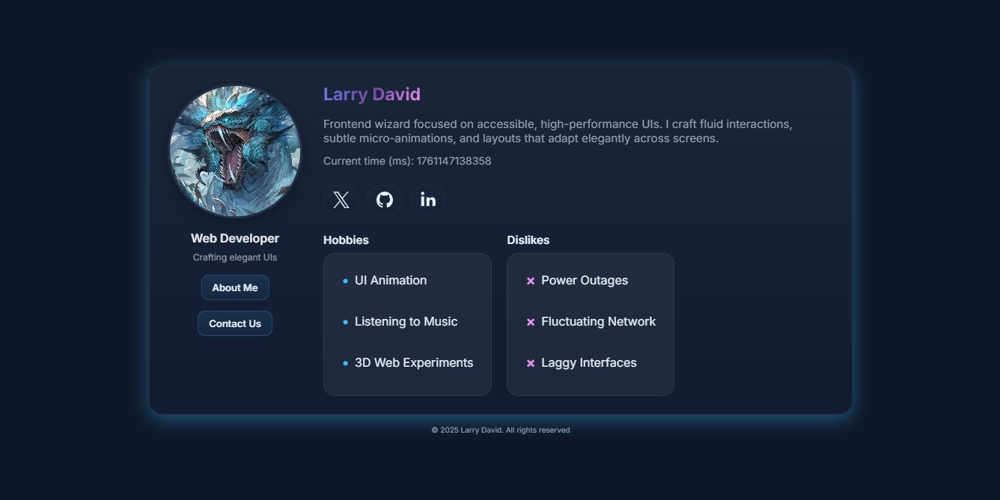

# Profile Card - Stage 0 (Frontend Wizards, HNG13)

Welcome to my Ultramodern Profile Card project! 🎨

This is a clean, responsive, and interactive profile card built using *HTML, CSS, and vanilla JavaScript*. The card is designed to showcase a user's avatar, bio, hobbies, dislikes, and social links in a visually appealing and accessible way. It adapts seamlessly to mobile, tablet, and desktop screens, keeping the layout elegant and readable at all sizes.

---

## 🖼 Project Preview

Here’s a preview of the Profile Card design:



---

## What You’ll Find in This Project

- *Circular avatar* that remains proportional on all devices.
- *Hover and focus animations* with subtle glowing effects to give life to the card.
- *Dynamic time display* in milliseconds, reflecting the current moment.
- *Social links* (Twitter/X, GitHub, LinkedIn) opening in new tabs safely.
- *Hobbies and dislikes* listed clearly with visual markers.
- Fully *keyboard-accessible* and semantic HTML for accessibility.
- *Glassmorphic design* using gradients, transparency, and blur effects for a modern feel.

This project was built as part of a Frontend learning challenge, but everything here reflects real-world responsive and accessible design principles.

---

## Running the Project Locally

To run this project on your computer, follow these steps:

1. *Clone the repository*:

```bash

git clone https://github.com/L1a6/profile-card.git


